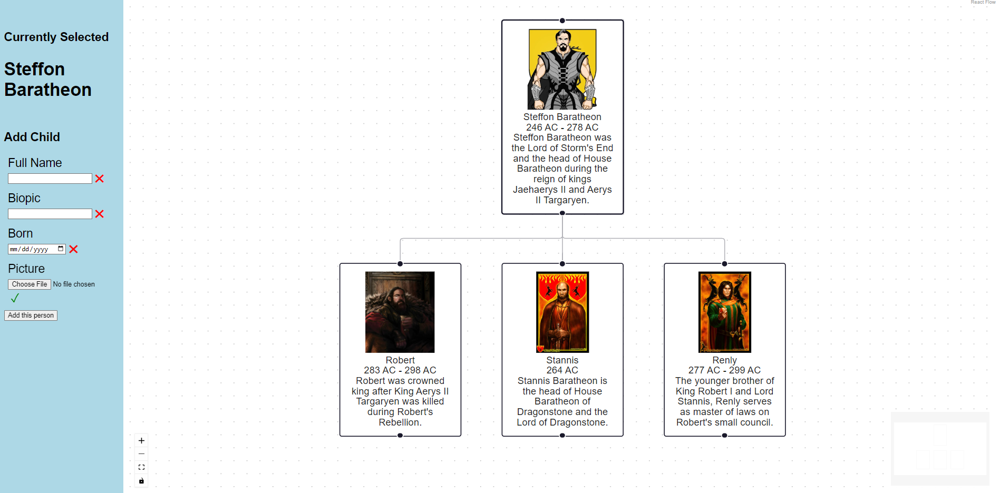

# Family Tree builder and viewer

> Note: this project is currently under construction

Simply build and view a family tree in your browser.

This application is based on React and for now is completely standalone (frontend only), with some limitations.

## Goals
- Provide a simple web-based user interface to create a family tree
- discover the react framework in the process

## Usage
`npm install && npm start`

## Application files hierarchy
| Folder | Description |
| --- | --- |
| src/App | The main Application component. For now, only creates a Flow component |
| src/Flow | The main Reactflow component. For now, this component is composed of the node viewer (reactflow), and the menu. In the future, the menu should be removed to better decouple Flow (hierarchy viewer) from Controls |
| src/ControlMenu | Define the components to add or edit nodes in the hierarchy. |

## Current snapshot

## Milestones

1. <del>Get a static version of a node hierarchy using reactflow</del>DONE
1. <del>Get a simple sidebar menu to add a person to the hierarchy</del>DONE
1. Get a simple menu to edit a person's detail
1. Move the ControlMenu component away from Flow to better decouple reactflow from the application
1. Test using D3 instead of reactflow:
    * reactflow is easy to use, MIT-licensed BUT has a pro version, not sure what this implies
1. Instead of relying on a side bar form, display a small toolbar above the person's avatar when selected